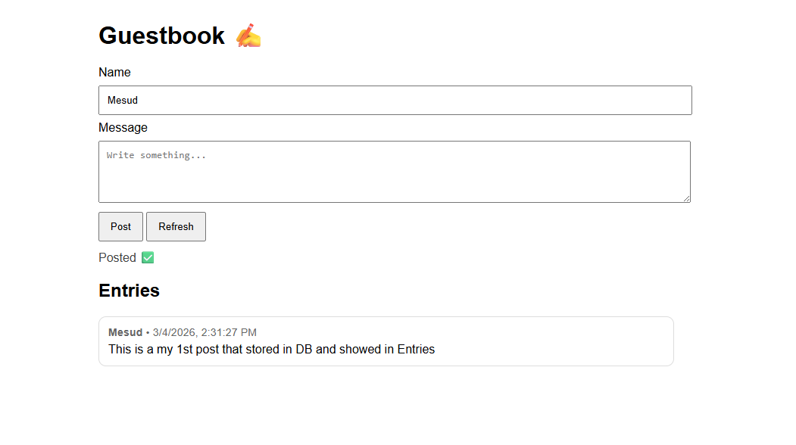

# Guestbook (Docker Compose)

A simple guestbook application built to practice **Docker**, **Docker Compose**, and **multi-container applications**.

The project demonstrates how to run a frontend, backend, and database together using Docker Compose.

---

## Application Preview

Frontend Guestbook Interface:

## Architecture

The application consists of three services:

- **Frontend** – Static website served by **Nginx**
- **Backend** – REST API built with **Node.js (Express)**
- **Database** – **PostgreSQL** storing guestbook entries

Docker Compose creates a private network so containers can communicate using service names.

Example connection inside the Docker network:

backend → db:5432

---

## Project Structure

guestbook/
│
├── docker-compose.yml
│
├── frontend/
│   └── index.html
│
├── backend/
│   ├── Dockerfile
│   ├── package.json
│   └── app.js
│
└── db/
    └── database.sql

---

## Prerequisites

Before running the project, install:

- Docker
- Docker Compose (v2)

Check installation:

docker --version  
docker compose version

---

## Running the Application

From the project root directory run:

docker compose up --build

Open the application in your browser:

Frontend  
http://localhost:8080

Backend health check  
http://localhost:5000/health

---

## Stopping the Application

To stop the containers:

docker compose down

---

## Resetting the Database

To remove the database volume and start fresh:

docker compose down -v  
docker compose up --build

⚠️ This will delete all stored guestbook messages.

---

## How Containers Communicate

Docker Compose automatically creates a network for the services.

Service names become hostnames.

Example:

services:
  backend:
  db:

Inside the backend container, the database is reachable via:

db:5432

Important note:

- `localhost` inside a container refers to the container itself.
- To reach another container, use the **service name**.

---

## Troubleshooting

### Database table does not exist

If you see an error like:

relation "entries" does not exist

The initialization SQL script probably did not run.

Fix by resetting the database volume:

docker compose down -v  
docker compose up --build

---

### SQL initialization file errors

Make sure `database.sql` is a real file and not a directory.

Correct location:

db/database.sql

---

### Port already in use

If ports `8080` or `5000` are already used, change them in `docker-compose.yml`.

Example:

ports:
  - "8081:80"

---

## Learning Goals

This project was created to practice:

- Docker images
- Dockerfiles
- Docker Compose
- Multi-container applications
- Container networking
- Persistent volumes
- Basic DevOps workflow

## License

MIT
