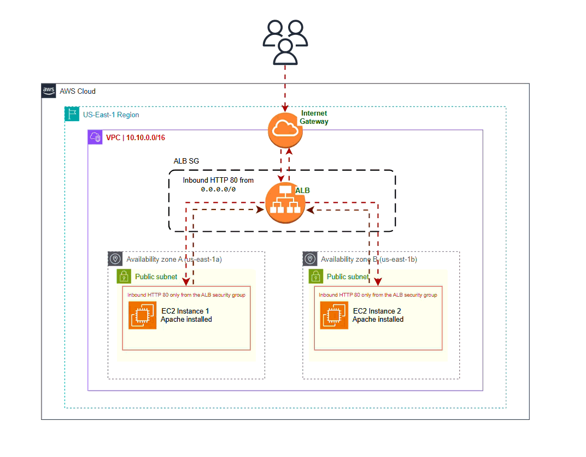

# Terraform AWS Load Balanced Web Servers


This project provisions a **highly available web infrastructure on AWS using Terraform**.

The infrastructure includes a **custom VPC, Application Load Balancer, and two EC2 instances** running Apache.
Traffic is distributed between instances by the load balancer.

This project demonstrates **Infrastructure as Code (IaC)** and basic **high availability architecture** in AWS.

---

# Architecture



The load balancer distributes HTTP requests between two EC2 instances running Apache.

Each instance displays its **public IP address**, allowing you to see the load balancing behavior when refreshing the page.

---

# Infrastructure Components

The Terraform configuration creates the following AWS resources:

* **VPC**
  CIDR: `10.10.0.0/16`

* **2 Public Subnets**
  Located in different availability zones

* **Internet Gateway**

* **Application Load Balancer (ALB)**

* **Target Group**
  With health checks on `/`

* **2 EC2 Instances**

  * Apache web server installed via `user_data`
  * Serve a simple HTML page displaying instance metadata

* **Security Groups**

  * ALB allows HTTP from the internet
  * EC2 instances allow HTTP only from the ALB

---

# Project Structure

```
terraform-aws-loadbalancer/
│
├── main.tf
├── vpc.tf
├── variables.tf
├── outputs.tf
└── user_data.tmpl
```

| File             | Description                                               |
| ---------------- | --------------------------------------------------------- |
| `main.tf`        | Core infrastructure (ALB, EC2 instances, security groups) |
| `vpc.tf`         | VPC creation using Terraform AWS VPC module               |
| `variables.tf`   | Input variables                                           |
| `outputs.tf`     | Terraform outputs                                         |
| `user_data.tmpl` | EC2 startup script installing Apache                      |

---

## Prerequisites

Before deploying the infrastructure, ensure the following:

* Terraform **>= 1.5**
* An **AWS account**
* An **EC2 instance configured as a Terraform execution host**
* The EC2 instance must have an **IAM role attached** with permissions to create AWS resources

Terraform is executed directly from the EC2 instance using the attached IAM role for authentication.

Verify Terraform installation:

```bash
terraform -version
```

---

## Deployment

Initialize Terraform:

```bash
terraform init
```

Preview the infrastructure changes:

```bash
terraform plan
```

Apply the configuration:

```bash
terraform apply
```

After deployment, Terraform outputs the **Application Load Balancer DNS name**.

Open it in your browser:

```
http://<alb_dns_name>
```

Refreshing the page should display different **EC2 public IP addresses**, showing how the load balancer distributes traffic between instances.

---

# Destroy Infrastructure

To remove all resources:

```
terraform destroy
```

---

# Learning Objectives

This project demonstrates:

* Infrastructure as Code with Terraform
* AWS networking fundamentals
* Load balancing with Application Load Balancer
* EC2 provisioning using user data
* Security group configuration
* High availability architecture basics

---

# Possible Improvements

Future improvements could include:

* Auto Scaling Group
* Launch Templates
* Private subnets for EC2 instances
* NAT Gateway
* HTTPS using ACM certificates
* Route53 domain integration
* Terraform remote state (S3 + DynamoDB)


---

# Author

This project was created as part of learning **Terraform and AWS cloud infrastructure automation**.

## License

MIT
